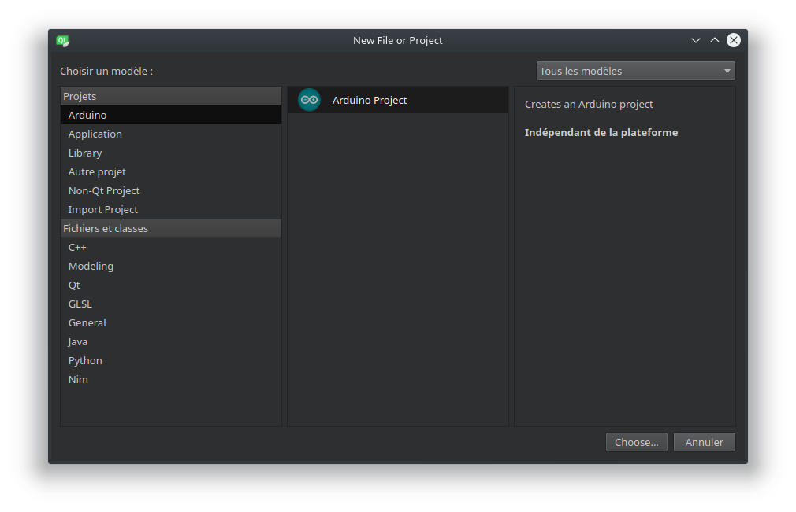

# arduino-qt-creator-plugin

Arduino integration in QtCreator IDE

**Work In Progress!**

## Why this project
- In order to familiarize myself with the QtCreator plugins
- Arduino IDE is too basic for me (no completion, ...)
- I love working with QtCreator IDE
- Good chalenge for me :)
- ...

## Expected features

- Provide Arduino device support (SDK configuration, ...)
- Arduino project template
- C++ project template
- AVR C project template
- Serial monitor
- Program download
- AVR compiler toolchain support
- AVR / Arduino Kit
- ...

## Arduino SDK setup

`Tools -> Options`

## Arduino Project

`File -> New File or Project`

## Build instructions

First of all, please refer to Qt documentation:
 - https://doc.qt.io/qtcreator-extending/getting-and-building.html
 - https://doc.qt.io/qtcreator-extending/first-plugin.html
 
 This plugin is developed against qt-creator `v4.5.2` `3c21c0d80b52eb43483308eccc663279e9f369a4`
 
